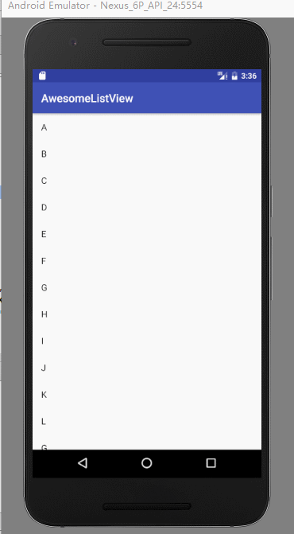

# 一个简洁美观的带下拉刷新和加载更多的listview
---
[](https://github.com/bboylin/AwesomeListView/blob/master/LICENSE.txt)




使用说明：
* step1：

Add it in your root build.gradle at the end of repositories:
```java
allprojects {
		repositories {
			...
			maven { url 'https://jitpack.io' }
		}
	}
```

* step2:

Add the dependency
```java
dependencies {
	        compile 'com.github.bboylin:AwesomeListView:v0.1.1'
	}
```

xml:
```xml
<RelativeLayout xmlns:android="http://schemas.android.com/apk/res/android"
    xmlns:tools="http://schemas.android.com/tools"
    android:layout_width="match_parent"
    android:layout_height="match_parent"
    tools:context=".MainActivity">

    <com.bboylin.awesomelistview.RefreshLayout
        android:id="@+id/refreshable_layout"
        android:layout_width="fill_parent"
        android:layout_height="fill_parent">

        <com.bboylin.awesomelistview.LoadMoreListView
            android:id="@+id/list_view"
            android:layout_width="fill_parent"
            android:layout_height="fill_parent"
            android:scrollbars="none"></com.bboylin.awesomelistview.LoadMoreListView>
    </com.bboylin.awesomelistview.RefreshLayout>

</RelativeLayout>
```

to refresh:
```java
refreshableLayout.setOnRefreshListener(new RefreshLayout.PullToRefreshListener() {
            @Override
            public void onRefresh() {
                //模拟刷新操作
                mHandler.sendEmptyMessageDelayed(0x123,2000);
            }
        });
```

to stop refreshing:`refreshableLayout.finishRefreshing();`

to load more :
```java
listView.setOnPullUpLoadListener(new LoadMoreListView.OnPullUpLoadListener() {
            @Override
            public void onPullUpLoading() {
            	//模拟加载更多操作
            	mHandler.sendEmptyMessageDelayed(0x124, 2000);
            }
        });
```

after loading data，this method should be manually called to stop loading:
`listView.onPullUpLoadFinished(boolean hasMoreItems);`

#License


    Copyright 2017 bboylin

    Licensed under the Apache License, Version 2.0 (the "License");
    you may not use this file except in compliance with the License.
    You may obtain a copy of the License at

       http://www.apache.org/licenses/LICENSE-2.0

    Unless required by applicable law or agreed to in writing, software
    distributed under the License is distributed on an "AS IS" BASIS,
    WITHOUT WARRANTIES OR CONDITIONS OF ANY KIND, either express or implied.
    See the License for the specific language governing permissions and
    limitations under the License.
